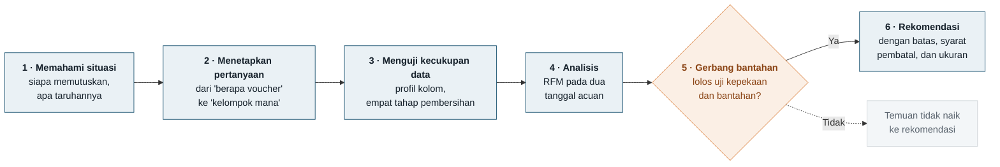

# Segmentasi Pelanggan Marketplace: Anggaran Retensi Rp 150 Juta

[](https://aoramaaulia-collab.github.io/Marketplace-RFM-Customer-Segmentation/)
[](https://colab.research.google.com/drive/1Dg-xTMAmUD9O0sIo7EfD25NtCa_z7xCf?usp=sharing)

Project ini menyegmentasi **48.130 transaksi dari 5.000 pelanggan** sebuah marketplace ritel daring dengan **SQL di DuckDB**. Tujuannya membagi **anggaran retensi Rp 150 juta per kuartal**, yang selama ini dibagi rata ke semua pelanggan. Hasilnya adalah usulan dua program terukur, lengkap dengan kelompok pembanding dan ukuran keberhasilan yang ditetapkan sebelum programnya jalan.

**Buka portofolio:** https://aoramaaulia-collab.github.io/Marketplace-RFM-Customer-Segmentation/

> **Catatan data.** Dataset dirancang meniru pola transaksi marketplace. Ini bukan data perusahaan sungguhan, dan tidak disajikan sebagai pengalaman kerja di perusahaan mana pun.

---

## Daftar isi

1. [Ringkasan dalam satu menit](#ringkasan-dalam-satu-menit)
2. [Konteks bisnis](#konteks-bisnis)
3. [Alur pengerjaan](#alur-pengerjaan)
4. [Tools yang digunakan](#tools-yang-digunakan)
5. [Data dan pembersihan](#data-dan-pembersihan)
6. [Temuan utama](#temuan-utama)
7. [Rekomendasi](#rekomendasi)
8. [Yang akan diukur](#yang-akan-diukur)
9. [Berkas pendukung](#berkas-pendukung)
10. [Cara menjalankan sendiri](#cara-menjalankan-sendiri)
11. [Keterbatasan dan pengembangan berikutnya](#keterbatasan-dan-pengembangan-berikutnya)
12. [Kamus istilah](#kamus-istilah)

---

## Ringkasan dalam satu menit

Rp 150 juta dibagi rata ke 5.000 pelanggan berarti **Rp 30.000 per orang per kuartal**. Kuartal lalu cara ini menghasilkan open rate email 12% dan redemption voucher 3%. Pertanyaannya: apakah anggaran yang sama lebih berguna bila dipusatkan, dan kalau ya, ke mana?

| Pertanyaan | Jawaban dari project ini |
|---|---|
| Apakah nilai pelanggan terkonsentrasi? | **Ya, tetapi lebih sedang dari aturan 80/20.** 400 pelanggan (8%) memegang 28,7% nilai transaksi; 20% teratas memegang 49,2%, bukan 80% |
| Adakah kelompok bernilai yang sedang pergi? | **Ya, dan baru terbentuk.** 900 pelanggan yang dulu rajin kini bermedian 112 hari tanpa transaksi, membawa Rp 2,74 miliar nilai historis. 857 di antaranya masih rutin belanja tiga bulan sebelumnya |
| Kenapa lebih dari separuh pelanggan tidak mendapat program? | 2.600 pelanggan (52%) adalah **pembeli ringan** yang kebiasaan belanjanya tidak pernah terbentuk, bukan pelanggan setia yang hilang |
| Ke mana anggarannya diarahkan? | **Rp 90 juta** untuk apresiasi 400 Champions, **Rp 50 juta** untuk uji win-back terukur, dan **Rp 10 juta** cadangan pengukuran |

---

## Konteks bisnis

### Latar belakang

Sebuah marketplace dengan lima kategori produk memegang anggaran retensi Rp 150 juta per kuartal. Selama ini anggaran itu dibagi rata, dan tidak pernah ada yang memeriksa apakah pelanggan memang sama nilainya. Keputusan pembagian Q2 2026 diambil di awal April dengan data per 31 Maret, dan ditanggung satu orang: **pemegang anggaran retensi**, yang harus mempertahankannya di depan manajemen angka demi angka.

### Pertanyaan bisnis

> **Pertanyaan utama:** kelompok pelanggan mana yang anggarannya dipusatkan, atas dasar apa, dan kenapa sebagian pelanggan sengaja tidak mendapat apa pun?

### Yang bukan tujuan

| Bukan tujuan | Alasan |
|---|---|
| Menghitung ROI atau proyeksi pemulihan | Tidak ada data hasil campaign di tabel transaksi |
| Membagi anggaran per kanal | Tidak ada data biaya per kanal |
| Menjelaskan kenapa pelanggan berhenti | Pindah ke pesaing, kecewa pengiriman, dan sekadar tidak butuh lagi tampak identik di data transaksi |

---

## Alur pengerjaan



Tiga langkah pertama memakan waktu hampir sebanyak tiga langkah terakhir, dan itu disengaja. Tiga keputusan ditetapkan tertulis sebelum kueri analisis pertama dijalankan:

| Keputusan | Yang dipilih | Yang ditolak, dan kenapa |
|---|---|---|
| Definisi transaksi | Baris unik bernilai positif sampai tanggal acuan | Memakai seluruh baris apa adanya: duplikat menggelembungkan frekuensi, dan `sum()` diam-diam melewati nilai kosong sementara `count()` tetap menghitungnya |
| Tanggal acuan dan jendela | Literal `2026-03-31`, riwayat dihitung dalam jendela tetap 15 bulan | Tanggal sistem, karena hasilnya berubah tiap hari. Riwayat kumulatif, karena tiap kuartal tambahan membuat ambang yang sama makin mudah dilewati |
| Garis antar-segmen | Ditetapkan sesudah membaca sebaran, lalu diuji kepekaannya pada tujuh geseran | Skoring kuintil: hasilnya searah, tetapi jauh lebih sulit dijelaskan ke pemegang anggaran |

Ambang segmen yang dipakai:

| Segmen | Syarat |
|---|---|
| Champions | Recency ≤ 30 hari, Frequency ≥ 15, Monetary > Rp 5 juta |
| Loyal | Recency ≤ 90 hari, Frequency ≥ 8 |
| At Risk | Recency > 90 hari, Frequency ≥ 5 |
| Lost | Selebihnya |

---

## Tools yang digunakan

| Kategori | Tools | Dipakai untuk |
|---|---|---|
| **Bahasa kueri** | SQL | Seluruh pembersihan, agregasi, segmentasi, uji kepekaan, dan desain uji win-back |
| **Mesin SQL** | DuckDB | Menjalankan SQL langsung di notebook, tanpa server |
| **Bahasa dan lingkungan kerja** | Python, Jupyter Notebook, Google Colab | Memuat data dan menjalankan notebook |
| **Analisis data** | pandas | Menampilkan hasil kueri sebagai tabel |
| **Visualisasi** | Matplotlib | Merender delapan gambar di notebook |
| **Portofolio** | HTML, CSS, GitHub Pages | Halaman portofolio yang bisa dibuka siapa saja |
| **Versi kode dan dokumentasi** | Git, GitHub | Menyimpan notebook, data, dan dokumentasi project |

Pembagian kerjanya disengaja: **setiap angka dihitung dengan SQL**, dan Python hanya merender gambar.

---

## Data dan pembersihan

Satu tabel transaksi, lima kolom (`TransactionID`, `CustomerID`, `TransactionDate`, `TotalValue`, `ProductCategory`), 50.980 baris mentah dari Januari 2025 sampai Maret 2026, ditambah 50 baris bertanggal sesudahnya.

| Tahap | Yang dibuang | Dibuang | Sisa |
|---|---|---:|---:|
| Mentah | | | 50.980 |
| Dedup | Duplikat persis di kelima kolom | 2.400 | 48.580 |
| Nilai kosong | `TotalValue` NULL, pembayaran gagal | 350 | 48.230 |
| Nilai tak positif | Refund dan sampel gratis | 50 | 48.180 |
| Tanggal | Bertanggal sesudah tanggal acuan | 50 | 48.130 |

Jumlah pelanggan unik tetap 5.000 sebelum dan sesudah pembersihan. Notebook memeriksa kelima angka di atas sebagai **gerbang**, dan berhenti sendiri bila salah satunya meleset.

---

## Temuan utama

| Segmen | Pelanggan | Pangsa pelanggan | Median Recency | Median Frequency | Pangsa nilai |
|---|---:|---:|---:|---:|---:|
| Champions | 400 | 8,0% | 3 hari | 22 | 28,7% |
| Loyal | 1.100 | 22,0% | 19 hari | 16 | 30,2% |
| At Risk | 900 | 18,0% | 112 hari | 11 | 24,7% |
| Lost | 2.600 | 52,0% | 91 hari | 5 | 16,4% |

Total nilai transaksi bersih: Rp 11,10 miliar.

1. **Nilai terkonsentrasi, tetapi lebih sedang daripada yang biasa diasumsikan.** 400 pelanggan memegang 28,7% nilai, atau 3,59 kali porsi seimbangnya. 399 dari 400 pelanggan dengan belanja terbesar adalah Champions. Aturan 80/20 tidak berlaku di sini: 20% pelanggan teratas memegang 49,2%.
2. **Nilai yang sebanding sedang pergi, dan kelompoknya baru terbentuk.** Ketika segmentasi dijalankan ulang per 2025-12-31, 857 dari 900 pelanggan At Risk masih tergolong Loyal. Angka ini tetap 850 bila panjang riwayat disamakan di kedua tanggal, jadi perpindahannya murni perilaku. Pelanggan aktif per kuartal bertahan di sekitar 3.950 selama empat kuartal, lalu turun ke 2.789 di Q1 2026.
3. **Mayoritas pelanggan adalah pembeli ringan.** Segmen Lost terbelah dua sama besar: 1.300 masih belanja dalam 90 hari terakhir tetapi hanya 5 sampai 7 kali dalam 15 bulan, dan 1.300 sudah lebih lama tak terlihat dengan 2 sampai 4 transaksi. Label "Lost" terlalu keras untuk separuh pertamanya, dan ini dinyatakan terbuka.

**Uji kepekaan.** Tujuh geseran ambang diuji satu per satu. Menurunkan ambang frekuensi Loyal dari 8 ke 6 memindahkan 824 pelanggan, sedangkan menaikkan ambang hari Champions 50% tidak memindahkan seorang pun. Di ketujuh geseran, Champions tetap memegang 28,7% sampai 30,7% nilai, dan kelompok yang baru menjauh tetap ada.

---

## Rekomendasi

| Program | Sasaran | Porsi | Per kepala |
|---|---|---:|---:|
| Apresiasi dan akses prioritas | 400 Champions | Rp 90 juta | Rp 225.000 |
| Uji win-back terukur | 552 At Risk berjeda 91–120 hari: 276 dikirimi, 276 pembanding | Rp 50 juta | Rp 181.159 per orang yang dikirimi |
| Cadangan pengukuran dan kanal | Lintas program | Rp 10 juta | – |

- **Apresiasi, bukan diskon**, karena median Recency Champions 3 hari. Mereka sudah aktif tanpa dibayar.
- **Sasaran win-back dipersempit ke 552 orang** yang berhenti sejak Desember 2025. Kelompok ini membawa Rp 1,70 miliar dari Rp 2,74 miliar nilai At Risk.
- **Separuh sasaran sengaja tidak dikirimi apa pun.** Sekitar 80% pelanggan berprofil serupa historisnya bertransaksi lagi dalam satu kuartal tanpa program khusus. Tanpa pembanding, angka "berapa yang kembali" pasti terlihat bagus. Pembagiannya ditentukan oleh hash MD5 atas `CustomerID`, sehingga deterministik dan bisa diulang persis.

---

## Yang akan diukur

Tiga ukuran ditetapkan sebelum program berjalan dan dibaca pada **2026-06-30**:

| Ukuran | Cara membacanya |
|---|---|
| Tingkat pembelian ulang 276 yang dikirimi, dikurangi tingkat pembelian ulang 276 pembanding | Efek program. Dengan ukuran kelompok ini, hanya selisih sekitar 10–12 poin persen ke atas yang terbaca |
| Berapa dari 400 Champions yang masih Champions dengan jendela yang sama panjang | Deskriptif, bukan bukti efek. Patokannya: 81 dari 83 Champions bertahan tiga bulan tanpa program |
| Biaya per tambahan pelanggan yang kembali | Rp 50 juta dibagi selisih jumlah yang kembali antara kedua kelompok |

---

## Berkas pendukung

| Berkas | Isi |
|---|---|
| [`docs/index.html`](docs/index.html) | Halaman portofolio, dipublikasikan lewat GitHub Pages |
| [`analisis_rfm.ipynb`](analisis_rfm.ipynb) | Seluruh kueri SQL, uji kepekaan, uji bantahan, delapan gambar, dan daftar penugasan uji win-back. [Buka di Colab](https://colab.research.google.com/drive/1Dg-xTMAmUD9O0sIo7EfD25NtCa_z7xCf?usp=sharing) |
| [`memo-keputusan_rfm.pdf`](memo-keputusan_rfm.pdf) | Satu halaman untuk pemegang anggaran: rekomendasi, batas, dan syarat pembatal. [Versi Google Drive](https://drive.google.com/file/d/1PL59GrHI-ZD87QTChhbDHAewwFJd4b6Z/view?usp=sharing) |
| [`catatan-keputusan_rfm.md`](catatan-keputusan_rfm.md) | Setiap definisi, ambang, dan pilihan yang ditolak, berikut alasannya dan kueri final. [Versi Google Docs](https://docs.google.com/document/d/1ZrIZpOtAFbNOBuTuH0Xio1yzUDBXXiJUfLxGqKqqEtY/edit?usp=sharing) |
| [`lampiran-bukti_rfm.pdf`](lampiran-bukti_rfm.pdf) | Tiga gambar penopang memo dan tabel telusur asal-usul setiap angka |

---

## Cara menjalankan sendiri

### Paling mudah: Google Colab

Klik tombol **Open in Colab** di atas, simpan salinannya ke Drive Anda (File → Simpan salinan di Drive), unggah `transactions.csv` ke panel berkas Colab, lalu jalankan semua sel.

### Di komputer sendiri

```bash
git clone https://github.com/aoramaaulia-collab/Marketplace-RFM-Customer-Segmentation.git
cd Marketplace-RFM-Customer-Segmentation
pip install -r requirements.txt
jupyter notebook analisis_rfm.ipynb
```

Jalankan notebook dari atas ke bawah, lalu cocokkan jumlah tiap tahap pembersihan dengan 50.980, 48.580, 48.230, 48.180, dan 48.130. Tanggal acuan terkunci sebagai literal di dalam kueri, jadi hasilnya sama kapan pun notebook dijalankan.

### Struktur folder

```
Marketplace-RFM-Customer-Segmentation/
├── analisis_rfm.ipynb          Notebook analisis lengkap
├── transactions.csv            Data transaksi mentah, 50.980 baris
├── requirements.txt            Paket Python yang dibutuhkan
├── memo-keputusan_rfm.pdf      Memo keputusan satu halaman
├── catatan-keputusan_rfm.md    Catatan keputusan dan kueri final
├── lampiran-bukti_rfm.pdf      Gambar penopang dan tabel telusur
└── docs/
    ├── index.html              Halaman portofolio (GitHub Pages)
    └── portofolio_rfm_Aulia_Aorama.pdf
```

---

## Keterbatasan dan pengembangan berikutnya

**Keterbatasan**

- **Seluruh angka menggambarkan perilaku sampai 2026-03-31.** Rekomendasinya mengasumsikan Q2 2026 menyerupai lima kuartal terakhir, dan asumsi itu tidak bisa diuji dari data transaksi
- **Rp 2,74 miliar adalah nilai historis, bukan proyeksi pemulihan.** Berapa yang bisa dipulihkan belum diketahui, dan karena itu programnya berbentuk uji terukur
- **Tidak ada data hasil campaign, biaya per kanal, atau alasan berhenti**, sehingga laporan ini tidak memuat angka ROI
- **Garis antar-segmen adalah keputusan analisis.** Kepekaannya diuji dan dilaporkan, tetapi tetap pilihan, bukan hukum alam

**Pengembangan berikutnya**

- Memecah segmen Lost menjadi dua segmen dengan nama yang jujur: pembeli ringan yang masih aktif dan yang sudah lama tak terlihat
- Menjalankan segmentasi ulang tiap kuartal dengan jendela 15 bulan yang sama
- Membaca hasil uji win-back per 2026-06-30, lalu menentukan skala program Q3 2026 dari hasil itu

---

## Kamus istilah

| Istilah | Artinya |
|---|---|
| **RFM** | Recency, Frequency, Monetary: tiga ukuran perilaku belanja per pelanggan |
| **Recency** | Jumlah hari sejak transaksi terakhir, dihitung terhadap tanggal acuan |
| **Frequency** | Jumlah transaksi bersih dalam jendela 15 bulan |
| **Monetary** | Total nilai transaksi bersih dalam jendela 15 bulan |
| **Tanggal acuan** | Tanggal "hari ini" dalam analisis, dikunci di 2026-03-31 agar hasilnya bisa direproduksi |
| **Win-back** | Program untuk mengajak kembali pelanggan yang berhenti belanja |
| **Kelompok pembanding** | Pelanggan yang sengaja tidak dikirimi program, supaya efek program bisa dipisahkan dari yang kembali dengan sendirinya |
| **Batas deteksi** | Selisih terkecil yang bisa dibedakan dari kebetulan dengan ukuran kelompok yang tersedia |
| **Gerbang** | Pemeriksaan yang harus lolos sebelum analisis boleh berlanjut |

---

## Tentang pembuat

**Aulia Aorama**
GitHub: [@aoramaaulia-collab](https://github.com/aoramaaulia-collab)
Email: [aoramaaulia@gmail.com](mailto:aoramaaulia@gmail.com)
